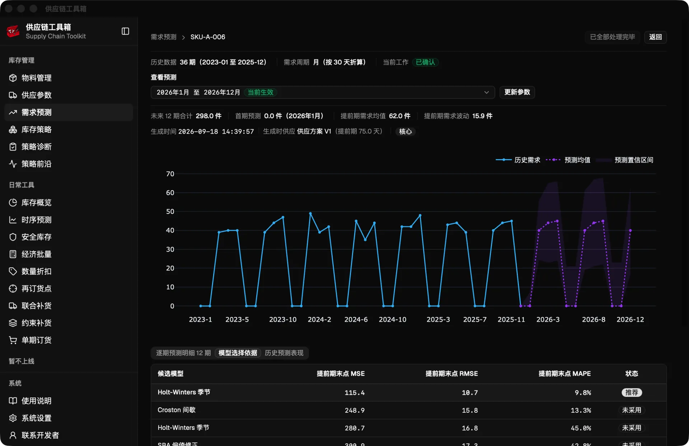
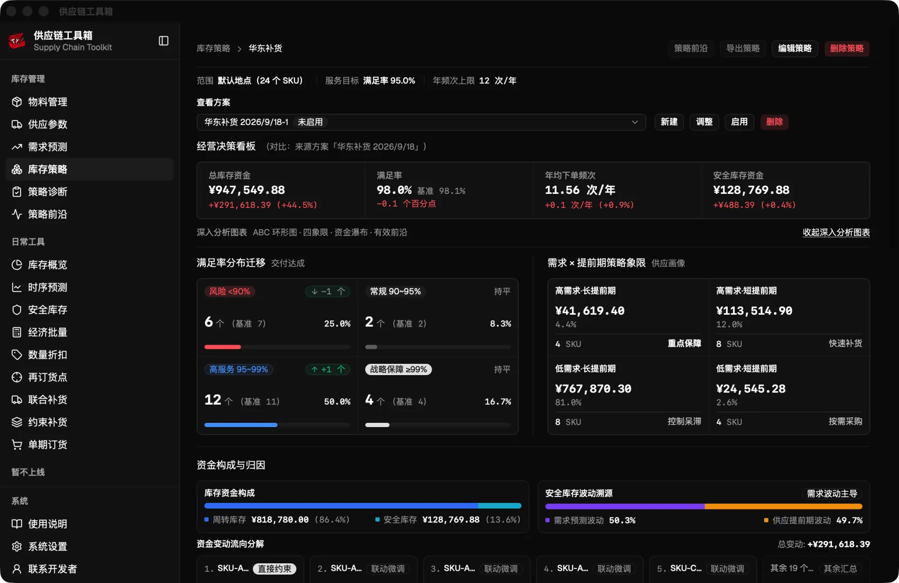
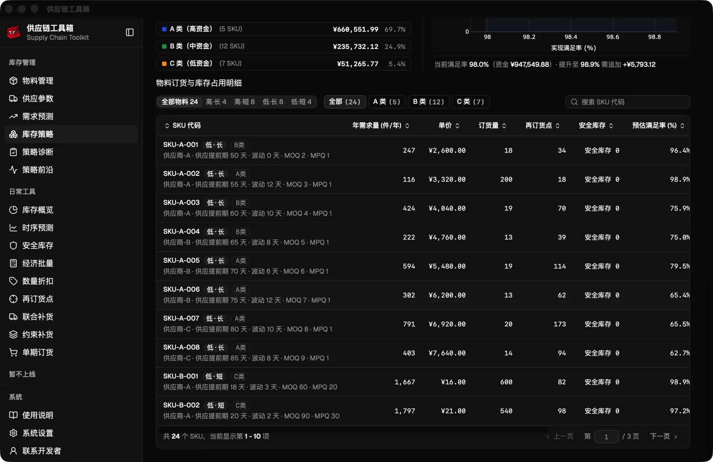
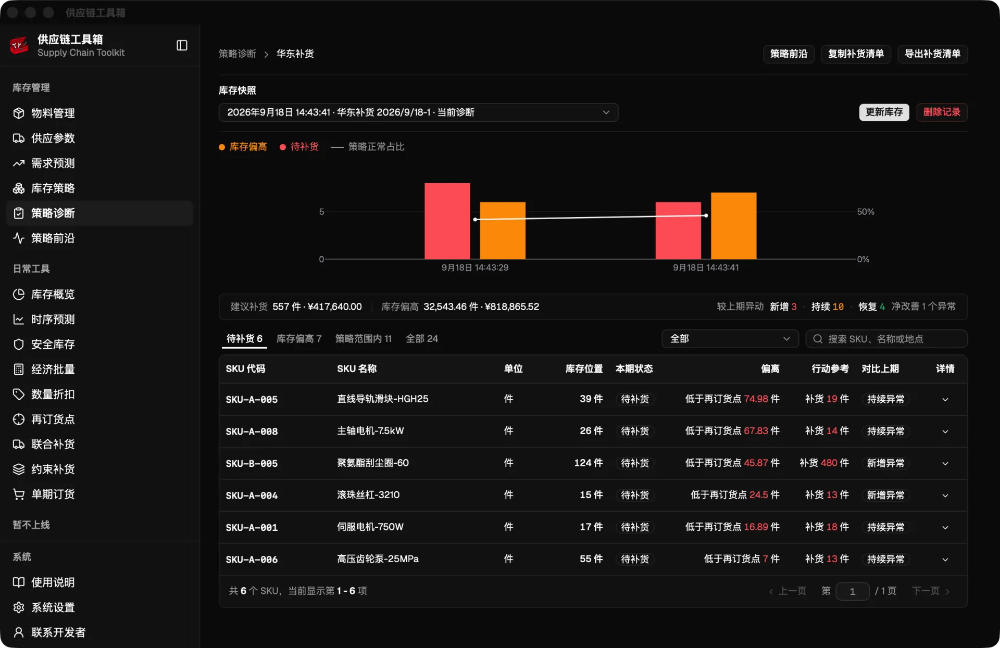
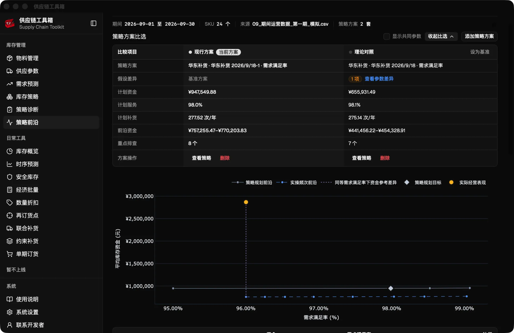
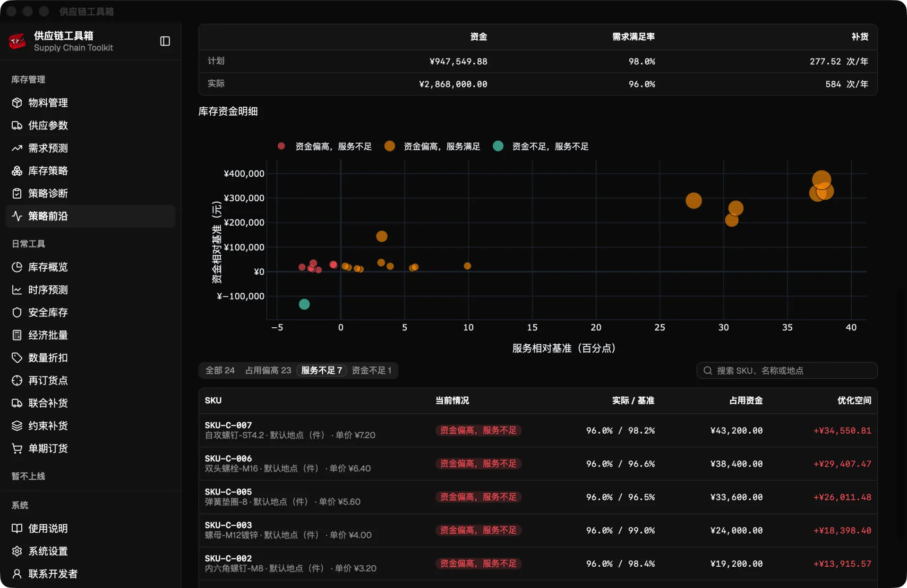
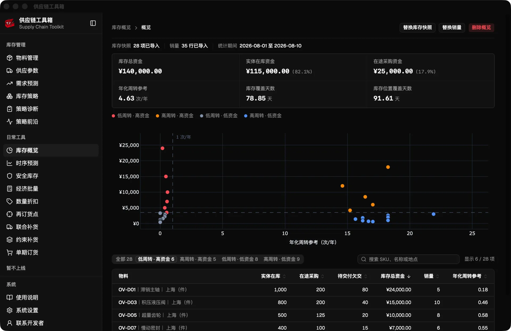
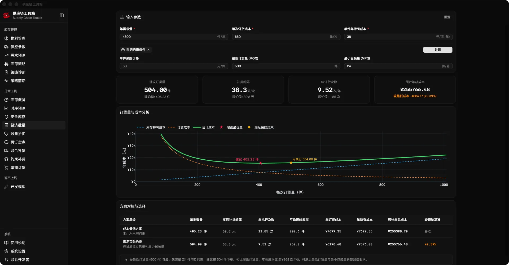

  

  
  
  
  
  

---

# 供应链工具箱 (Supply Chain Toolkit)

面向制造业、工贸一体及分销零售企业的桌面级库存决策工具。**不用配置数据库、不用联网、零部署成本**。把日常的 Excel/CSV 表格拖进来，即可一键完成需求预测、多 SKU 订货策略全局优化、库存健康度体检、呆滞缺货诊断与运筹模型测算。

---

## 核心功能

### 需求预测

  

---

### 库存策略

  

  

---

### 策略诊断

  

---

### 策略前沿

  

  

---

### 库存概览

  

---

### 常用工具

  

---

## 下载

[网盘下载](https://pan.xunlei.com/s/VP1mnS_4Vc9pAVDJJg0QC6NdA1?pwd=rv6r)

---

## 交流

  

  欢迎扫码添加微信交流（请注明来意）

